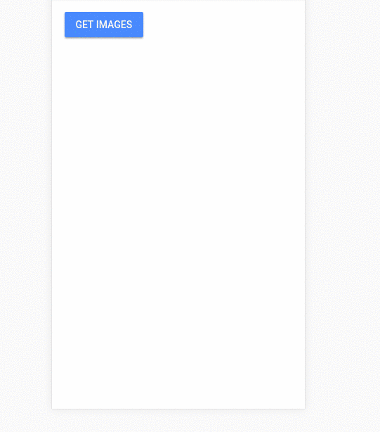

# ng-image-preview

Thanks by service used for tests on https://randomuser.me/

## Installation

To install this library, run:

```bash
$ npm install @pluritech/ng-image-preview --save
```

## Using the ng-image-preview

```typescript
import { BrowserModule } from '@angular/platform-browser';
import { NgModule } from '@angular/core';

import { AppComponent } from './app.component';

// Import the library
import { NgImagePreviewModule } from '@pluritech/ng-image-preview';

@NgModule({
  declarations: [
    AppComponent
  ],
  imports: [
    BrowserModule,

    // Specify the library as an import
    NgImagePreviewModule
  ],
  providers: [],
  bootstrap: [AppComponent]
})
export class AppModule { }
```

Once the library is imported, you can use image-preview component in your Angular application:

```xml
<div *ngFor="let user of userArr">
  <image-preview
    [urlLittle]="user.picture.thumbnail"
    [urlBig]="user.picture.large"
    [alt]="user.picture.title">
  </image-preview>
</div>
```

Mateus Durâes: https://github.com/mateusduraes
Lucas Corrẽa: https://github.com/lucascco

## License

MIT © [Lucas Correa & Mateus Durães](mailto:lucasccorrea@gmail.com)
