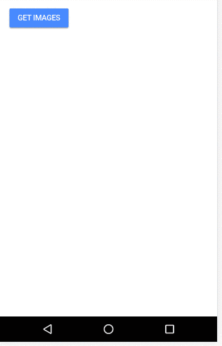

# Angular Image Preview
<p align="center">
  
</p>

This library was creating to abstract the [LQIP – Low Quality Image Placeholders](http://www.guypo.com/introducing-lqip-low-quality-image-placeholders/) technique used by Medium and Instagram to Angular apps. The code was implemented inspired by this awesome [codepen](https://codepen.io/jmperez/pen/yYjPER) made by [@JMPerez](https://github.com/JMPerez).

And we used [RandomUser API](https://randomuser.me) to make our tests in development environment.

## How it works? (short explanation)

First, we load the image with low quality and it is really fast. So, the user who have a slow internet can see a preview of what is coming.
Then, we load the same image, but, with a high quality.

It is a short explanation of how this technique works, if you want to know more, just visit the links above!

## Installation

To install this library, run:

```bash
$ npm install @pluritech/ng-image-preview --save
```

## Using the ng-image-preview

```typescript
import { BrowserModule } from '@angular/platform-browser';
import { NgModule } from '@angular/core';

import { AppComponent } from './app.component';

// Import the library
import { NgImagePreviewModule } from '@pluritech/ng-image-preview';

@NgModule({
  declarations: [
    AppComponent
  ],
  imports: [
    BrowserModule,

    // Specify the library as an import
    NgImagePreviewModule
  ],
  providers: [],
  bootstrap: [AppComponent]
})
export class AppModule { }
```

Once the library is imported, you can use image-preview component in your Angular application:

```xml
<div *ngFor="let picture of pictures">
  <image-preview
   [lowImage]="picture.thumbnail"
   [hqImage]="picture.large"
   paddingBottom="95%"
   filterLowImage="blur(10px)">
  </image-preview>
</div>
```

## Parameters
| Parameter        | Description           |
| ------------- |:-------------:|
| lowImage     | low image url |
| hqImage     |  high quality image url |
| paddingBottom | a padding-bottom value, to prevent the reflow, default is 66.6%       |
| bgPlaceholder | a background-color value to fill the placeholder 'container'      |
| filterLowImage | a filter value to image small like 'blur(10px)'. Default is 'blur(20px)'       |


## To do
* Manage images in cache
* Implement a fallback image inputted by user
* Implement the 'alt' attribute inputted by user

Feel free to make your pull request.

## Authors

Lucas Corrẽa: https://github.com/lucascco
Luis Moreno: https://github.com/luishmcmoreno
Mateus Durâes: https://github.com/mateusduraes

## License

MIT © [Lucas Correa & Mateus Durães & Luis Moreno](mailto:lucasccorrea@gmail.com)
